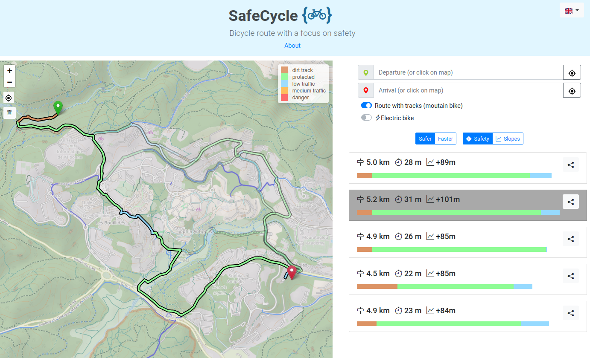

## About

This repository contains the code of [safecycle.atelier-des-communs.fr](https://safecycle.atelier-des-communs.fr/). 
It is a free bicycle route service, focused on safety.

It is an alternative / simplified interface to [Brouter.de](<http://brouter.de/brouter-web/>), with specific profiles avoiding unprotected roads and integrating the use of mountain bikes (dirt roads).

This service is developed by [l'Atelier des communs](<https://atelier-des-communs.fr>) / [Raphaël Jolivet](<https://raphael-jolivet.name>).



## Setup

This website is developped in Python / [Flask](https://flask.palletsprojects.com/en/2.0.x/])

1) Create a file `.env` with the same folder, with at least the mandatory parameter set :

   | Key         | Value     | Default |
   |--------------|-----------|------------|
   | **SECRET_KEY** | "any-secret-123" (for session) | **mandatory**        |
   | **FLASK_ENV**  | development / production  | **mandatory**       |
   | **CENTER** | Initial center of map : lat,lon | **mandatory** |
   | COUNTRY | 2 letter country code to restrict location search  | empty |
   | INIT_ZOOM | Initial zoom | 14 |
   | CACHE_DEFAULT_TIMEOUT | Timeout for cache of resquests to Brouter, in seconds | 24 * 3600 |    
   | STATIC_CACHE_TIMOUT | Timeout for cache of resquests to Brouter, in seconds | 24 * 3600 |  
                                                       
   See other settings in [config.py](lib/config.py)                                                     

2) Install dependencies :
    
    ```> pip install -r requirements```

3) Run flask 

    ```> flask run```
    
4) Access [http://localhost:5000](http://localhost:5000)
    
For production, you might want to use a WSGI server like [gunicorn](https://gunicorn.org/)

    
## Licence 

This code is provided under the [BSD license](LICENCE)

## Donations

If you find this service useful, you can make a   [donation on Paypal](<https://www.paypal.com/paypalme/atelierdescommuns>)  to support my work.

Thanks.

## Contact

You can contact me at [raph@atelier-des-communs.fr](<mailto:raph@atelier-des-communs.fr>)